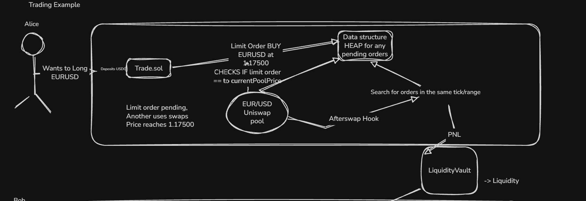
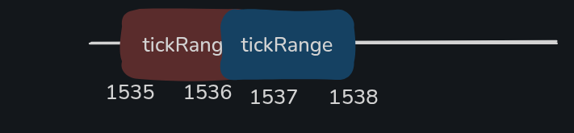
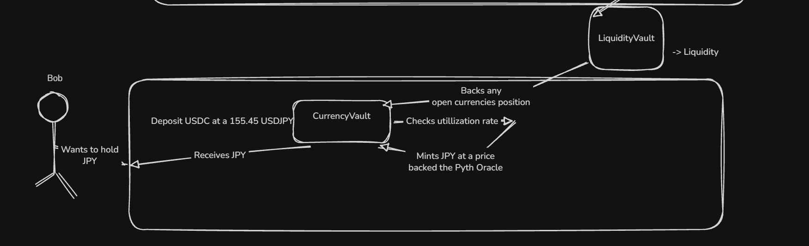

# 0xfx Atrium Hook

## Overview

There's a problem right now — actually, multiple:

- There aren't enough different stablecoins (USD, EUR... where's the rest?)
- There's no volume

Forex is an industry that has come close to **$10 trillion** in volume per day, while we're currently struggling to even break **$1 billion** in forex perps volume today. That says a lot about where our industry's focus needs to shift: toward stablecoins.

We could wait for every country to provide a legal pathway for a stablecoin, and then wait for a company trusted enough to back it — but that just won't cut it in the web3 world.

We loved DAI because it was actually backed by a currency we consider "holy."

### Here's where 0xfx comes in

The simple goal: open up the world of forex to enable smooth processing of all popular FX currencies:

- EUR/USD
- GBP/USD
- USD/JPY
- ...and more

## Contract Structure

The contract consists of:

- `HookContract`
- `TradeContract`
- `VaultContract`
- `CurrencyVault`
- `StorageContract`

---

## How Does It Work?

Whenever a user wants to hold a foreign currency (JPY or any other), they can mint it with USDC through the `CurrencyVault` and speculate with it.

If the foreign currency rises higher than the deposited USDC, the `HookVault` backs it — funded by PNL, market-making profit, and liquidity from liquidity providers.

The trading broker/platform is what brings in the PNL and market-making opportunities. Whenever a user swaps one of the pairs, it simply triggers an `afterSwap` hook call, which executes any pending orders — creating a clean loop with no off-chain nodes.

Depending on the swap amount, the swap will move around `prevTick + 1` and `nextTick - 1`. The `+1`/`-1` accounts for cases where the exact tick price isn't reached — more on this below.

---

## Uniswap Hooks

- **`afterSwap`** — called after every swap on a pool (e.g. EUR/USD). Executes the earliest order within the tick range and price.
- **`beforeInitialize`** — called whenever a new pool is initialized, to ensure the pool is verified in the `TradeContract`.

---

## Tick Range

Whenever a user places a pending order (think SL, TP, limit, etc.), the `getTickRange` function calculates the tick range position between `prevTick price + 1` and `nextTick price - 1`, which is split into 20 tick intervals.

The user is placed into one of those 20 tick intervals depending on their `sqrtPriceX96` and which side of the trade they choose. (It's rounded up in their favor!)

*Blue and red are both within the tick range.*

---

## Liquidity Vault

The Liquidity Vault gives users a near-guarantee that their currencies will be compensated on withdrawal. Whenever a user mints a currency through the `CurrencyVault`, their USDC deposit is always assured.

When a user trades, they're effectively in a battle against the Vault. If the Vault wins, the protocol wins — as with any trading platform, the platform needs to remain profitable overall.

